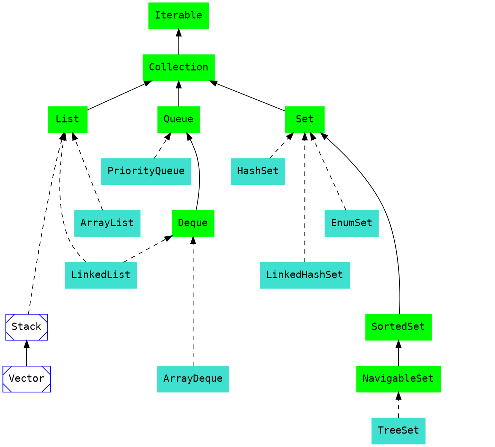
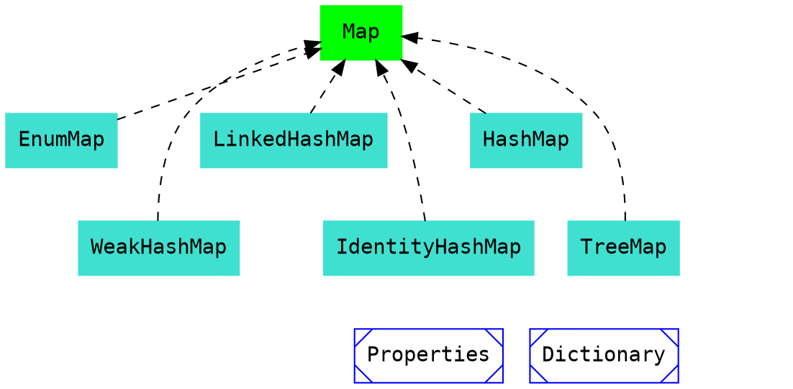

# Collections Framework (JCF)

Данный framework был введён в JDK 1.2 и дополнялся.

В JCL входят классы наследуемые от [Collection](/d12QhvOUQU-Fl5p6sGT8Wg), а также классы связанные с [Map](/CGxPIhaCQCyDZKV4DY59fA). Также есть классы для работы с коллекциями [Collections](/9rRUPBMKRFe5wLNriQG8PA).

Все классы лежат в пакете *java.util*.

gg

## Структура классов наследуемых от [Collection](/d12QhvOUQU-Fl5p6sGT8Wg)

### Интерфейсы
* [Iterable](/loXrkVXHRYeD-xMwmxqWRg)
* [Collection](/d12QhvOUQU-Fl5p6sGT8Wg)
* [List](/D14lbmObQh6VoCf9ShVBrQ)
* [ListIterable](/loXrkVXHRYeD-xMwmxqWRg)
* [Queue](/QkE8wOPNTXOjCpQJ34CreA)
* [Deque](/ZDBTJ76vTPaEIqm-6IcdEw)
* [Set](/-uew1P9dTNCudmZx6Rax7w)
* [SortedSet](/vjZrBI1oSl2hsNcjt6F_og)
* [NavigableSet](/OdXb8bocSXSeJgL3weeHQg)

### Реализации

| [List](/D14lbmObQh6VoCf9ShVBrQ)         | [Queue](/QkE8wOPNTXOjCpQJ34CreA)         | [Set](/-uew1P9dTNCudmZx6Rax7w)           |
| --------------------------------------- | ---------------------------------------- | ---------------------------------------- |
| [ArrayList](/DpaTujW8Q3qAoJ4OEWewBg)    | [PriorityQueue](/Ugpl7YjmSQm1yv6TXa5r0Q) | [HashSet](/Begue3wPSjGRwzlJaSZaPQ)       |
| [LinkedList](/ydKATRG5Rn-DRMpocZEdkg)   | [LinkedList](/ydKATRG5Rn-DRMpocZEdkg)    | [LinkedHashSet](/wEz3n8MDQBK5u_D3WGcjEw) |
| [Stack (old)](/zqhsf2NzSQOTtJ4OxKH4Eg)  | [ArrayDeque](/G18Hk4BNTvij1Lf37kw23Q)    | [EnumSet](/WP4ELpEGT52DYFTF54k9pg)       |
| [Vector (old)](/tsVthe2uQV-ZP-0oSnhtUg) |                                          | [TreeSet](/YtzyMrXBTvSRM_WU3mEuFQ)       |

## Структура классов наследуемых от [Map](/CGxPIhaCQCyDZKV4DY59fA)

### Интерфейсы
* [Map](/loXrkVXHRYeD-xMwmxqWRg)

### Реализации
* [EnumMap](/tG58ms5NTYGNybGMWo9LQw)
* [LinkedHashMap](/tqhOBvB_R9i1MlB-7n0EIA)
* [HashMap](/C-yEPF-BSzqzNsUAGej_Bg)
* [WeakHashMap](/0T5-ErJvSPmWKNIxUnzSeg)
* [IdentityHashMap](/xHpKb85BQrKU5rv7DBdJUQ)
* [TreeMap](/4mJ9iM1RTGmmXfxD9XrmGQ)

## Сторонние библиотеки
* Apache Commons
* Guava

## Унаследованные коллекции (устаревшие)
* [Vector](/tsVthe2uQV-ZP-0oSnhtUg)
* [Stack](/zqhsf2NzSQOTtJ4OxKH4Eg)
* HashTable
* Dictionary
* [Properties Class](/0Ns6F4VoRve3KWh7l8OLuw)

## Сторонние уроки и статьи
**[Tutorial](https://metanit.com/java/tutorial/5.1.php)**
[Полезная статья по коллекциям, о чём многие забывают](https://habr.com/en/post/267389/)

[Полный обзор по коллекциям и сторонним библиотекам](https://habr.com/en/company/luxoft/blog/256877/)
### Вопросы с собеседований
* [Часть 1](https://jsehelper.blogspot.com/2016/01/java-collections-framework-1.html)
* [Часть 2](https://jsehelper.blogspot.com/2016/01/java-collections-framework-2.html)
* [Часть 3](https://jsehelper.blogspot.com/2016/01/java-collections-framework-3.html)